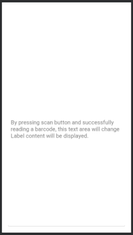

# java-samples

Java sample apps.

## Sample apps

| Name | Description | Screenshot
|------|-------------|-----------
| [BarCodeScannerHTML5](BarCodeScannerHTML5/) | Uses local html page to start/control decoder. | - 
| [CradleApp](CradleApp/) | Uses Self-shopping APIs to control the locking cradle. | -
| [DecodeConfigSampleAPI](DecodeConfigSampleAPI/) | Uses BarcodeManager to configure the decoder properties. | 
| [DecodeHTTPSampleAPI](DecodeHTTPSampleAPI/) | - | -
| [DecodeIntent](DecodeIntent/) | Passes scanned barcode data to different intents. | 
| [DecodeListener](DecodeListener/) | Uses BarcodeManager to display scanned barcode label. | 
| [DecodeSampleAPI](DecodeSampleAPI/) | Display barcodes, enable/disable symbologies and register/release listeners. | 
| [DeviceSampleAPI](DeviceSampleAPI/) | - | -
| [JoyaTouchCradleSampleAPI](JoyaTouchCradleSampleAPI/) | - | -
| [ZXingSampleAPI](ZXingSampleAPI/) | - | -