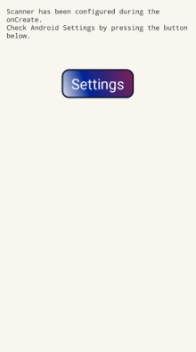
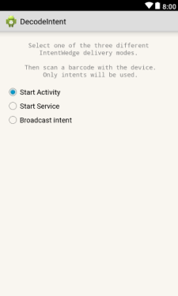
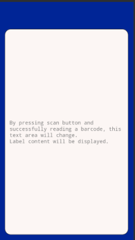
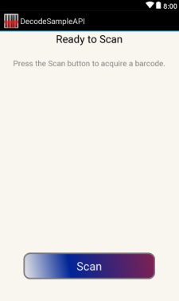

# kotlin-samples

Kotlin sample apps.

## Sample apps

| Name | Description | Screenshot
|------|-------------|-----------
| [BarCodeScannerHTML5](BarCodeScannerHTML5/) | - | - 
| [CradleApp](CradleApp/) | - | -
| [DecodeConfigSampleAPI](DecodeConfigSampleAPI/) | Configures device scanner settings using ScannerProperties. |      
| [DecodeHTTPSampleAPI](DecodeHTTPSampleAPI/) | - | -
| [DecodeIntent](DecodeIntent/) | Passes scanned barcode data to different intents.| 
| [DecodeListener](DecodeListener/) | Uses BarcodeManager to display scanned barcode label. | 
| [DecodeSampleAPI](DecodeSampleAPI/) | Display barcodes, enable/disable symbologies and register/release listeners. | 
| [DeviceSampleAPI](DeviceSampleAPI/) | - | -
| [JoyaTouchCradleSampleAPI](JoyaTouchCradleSampleAPI/) | - | -
| [ZXingSampleAPI](ZXingSampleAPI/) | - | -